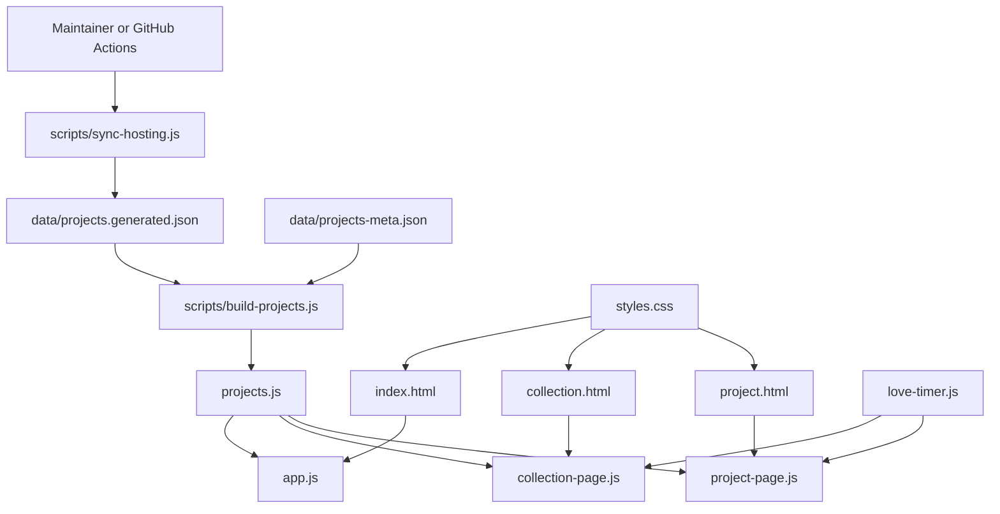

# DESIGN.md

## 1. Header

| Field | Value |
| --- | --- |
| Project Name | FunFam Projects Hub |
| Repository Directory | `fullstack-loving` |
| README Heading | `fullstack-harness-engineering` |
| Package Name | `fullstack-loving` |
| Version | `1.0.0` |
| Last Updated | `2026-05-27` |
| Author | Generated from repository analysis for handoff to Stitch |
| Primary Language | English |

> This document describes the current repository state as implemented in the codebase, including recent UI enhancements such as the AI chat placeholder on the girlfriend collection page.

---

## 2. System Overview

### Purpose

At the repository level, the README leads with an automation purpose:

> This repo can auto-sync projects from Vercel and Netlify, then rebuild `projects.js` for the static site.

At runtime, the codebase delivers **FunFam Projects Hub**, a static bilingual portfolio/archive website that aggregates emotionally meaningful projects across three audiences:

- `family`
- `girlfriend`
- `personal`

The site-level product copy defines the experience as:

- page title: `FunFam Projects Hub`
- meta description: `A personal hub that gathers meaningful projects for family, girlfriend, and personal work.`
- OG description: `A bilingual portfolio hub for emotional side projects, learning notes, and live website previews.`
- hero eyebrow: `FunFam Collection`
- hero title: `A home for meaningful projects built for family, for her, and for your own personal brand.`

This means the codebase has **two equally real purposes**:

1. maintain a synchronized deployment catalog from hosting providers
2. present that catalog as a polished, emotional, bilingual project hub

### Product Goals Derived From Real Copy

The goals below are pulled from the actual UI copy in `index.html`, `app.js`, and `data/projects-meta.json`.

| Goal | Source of truth |
| --- | --- |
| Gather personal projects into one place so they can be revisited, presented, and previewed easily | hero body copy |
| Turn emotional side projects into a polished personal portfolio | hero panel `Showcase` |
| Inspect each deployed website quickly without opening a new tab every time | hero panel `Preview` |
| Tie each build to one technical lesson so the portfolio becomes a learning lab | hero panel `Reflect` |
| Use personal projects as a serious engineering training ground | workflow title |
| Start from real human moments such as birthdays, memory walls, romantic surprises, and holiday experiences | workflow step 1 |
| Learn one hard skill per project such as animation, 3D, CI/CD, accessibility, testing, or CMS design | workflow step 2 |
| Keep an engineering loop after shipping by recording what worked and what to improve | workflow step 3 |

### Real Content Shape

The data model and curated metadata show that this is not a generic portfolio. It is organized around **gift-like and memory-rich web experiences** plus a smaller professional lane.

Representative projects currently in `data/projects-meta.json`:

- `Rose For Vy`: 20/10 microsite with a 3D rose garden, hidden note, and romantic background music
- `Valentine 26 For Sakna`: Valentine memory card game with victory modal and music
- `Merry Christmas Sakna`: interactive Christmas experience with Three.js and MediaPipe Hands
- `Happy Birthday Aunt Ut Thuy`: elegant birthday website with hero slider, gallery, wishes, and music
- `Thien Y`: vegetarian restaurant landing page
- `Martin Le Portfolio`: personal portfolio for Le Thanh Phat

The site is designed to:

- present projects in a polished portfolio interface
- filter and search projects on the client
- open live previews of deployed sites
- surface project case-study metadata
- generate collection-specific and project-specific detail views
- keep project inventory semi-automatically synchronized from hosting providers

### High-Level Operating Model

The system has **two major layers**:

1. **Runtime Presentation Layer**
   - Pure static frontend
   - HTML + CSS + vanilla JavaScript
   - No runtime backend/API owned by this project

2. **Maintenance / Build-Time Data Pipeline**
   - Node.js scripts sync hosting project inventory from Vercel and Netlify
   - Generated hosting data is merged with manually curated metadata
   - Final merged artifact is emitted as `projects.js`, which powers the frontend

### End-to-End Data Flow

```text
User/Browser
   |
   v
Static Pages (index.html / collection.html / project.html)
   |
   v
Browser loads projects.js
   |
   v
Client-side rendering logic
   |- app.js            -> main hub page
   |- collection-page.js -> audience collection page
   |- project-page.js    -> single project page
   \- love-timer.js      -> reusable timer utility


Maintainer / GitHub Actions
   |
   v
scripts/sync-hosting.js
   |- GET Vercel Projects API
   \- GET Netlify Sites API
   |
   v
data/projects.generated.json
   +
data/projects-meta.json
   |
   v
scripts/build-projects.js
   |
   v
projects.js
   |
   v
Frontend consumes merged project catalog
```

---

## 3. System Architecture

### Architecture Style

This project is best described as:

- **Static multi-page web application**
- **JAMstack-like delivery model**
- **Build-time data aggregation pipeline**
- **No server-side application runtime**

This is **not** a monolith with backend services, and it is **not** microservices.  
It is a **static frontend plus maintenance automation scripts**.

### Critical Files

These are the files Stitch should understand first because they define the product's true shape and operating model.

| File | Why it is critical |
| --- | --- |
| `README.md` | Defines the repo's primary automation purpose and operator workflow |
| `index.html` | Contains the main product narrative, hero copy, section structure, and page metadata |
| `app.js` | Main controller for translation, filtering, preview, modal detail, presentation mode, timeline, and metrics |
| `collection-page.js` | Defines audience-specific collection behavior, including the girlfriend love timer and AI demo shell |
| `project-page.js` | Defines the dedicated split-view project page and iframe fallback behavior |
| `styles.css` | Encodes the visual system: palette, typography, spacing, blur surfaces, rounded cards, and tone classes |
| `data/projects-meta.json` | Human-curated editorial content and the strongest signal of product intent |
| `data/projects.generated.json` | Raw synced deployment inventory from hosting providers |
| `projects.js` | Generated runtime dataset consumed by all frontend pages |
| `scripts/sync-hosting.js` | Source of truth for external provider integration, normalization, and sync failure behavior |
| `scripts/build-projects.js` | Source of truth for fallback content, default audience, and merged browser data |
| `.github/workflows/sync-projects.yml` | Source of truth for scheduled sync cadence and generated-file commit behavior |

### Core Components

| Layer | Component | Responsibility |
| --- | --- | --- |
| Frontend | `index.html` | Main hub page with search, filtering, stats, preview, timeline, modal presentation flow |
| Frontend | `collection.html` | Audience-specific collection page (`family`, `girlfriend`, `personal`) |
| Frontend | `project.html` | Single-project detail page with split metadata/live-preview layout |
| Frontend Logic | `app.js` | Main client-side controller for search/filter/render/preview/modal behavior |
| Frontend Logic | `collection-page.js` | Collection page rendering, love timer, AI demo chatbox placeholder |
| Frontend Logic | `project-page.js` | Single project page rendering and iframe fallback handling |
| Shared Utility | `love-timer.js` | Reusable date/ticker utilities for relationship timer features |
| Styling | `styles.css` | Shared visual system and responsive layout |
| Data Source | `data/projects.generated.json` | Auto-synced hosting inventory |
| Data Source | `data/projects-meta.json` | Human-authored metadata, descriptions, categorization, lessons |
| Generated Artifact | `projects.js` | Browser-consumable merged project dataset |
| Build Script | `scripts/build-projects.js` | Merges generated + manual metadata into final browser data file |
| Sync Script | `scripts/sync-hosting.js` | Pulls project inventory from Vercel and Netlify APIs |
| Automation | `.github/workflows/sync-projects.yml` | Scheduled/manual sync + rebuild + auto-commit workflow |

### Visual Identity Extracted From Code

The design system is implicit in `styles.css`. Stitch should inherit these values instead of inventing a new aesthetic.

#### Typography

| Role | Value |
| --- | --- |
| Serif display font | `"Fraunces", serif` |
| Sans UI font | `"Manrope", sans-serif` |
| Hero headline | `clamp(2.6rem, 5vw, 4.8rem)` |
| Stats numerals | `clamp(1.8rem, 3vw, 2.8rem)` |
| Card titles | `1.45rem` to `2rem` depending on context |
| Eyebrow / label scale | `0.68rem` to `0.72rem`, uppercase, `letter-spacing: 0.16em` |

#### Core Tokens

| Token | Value |
| --- | --- |
| `--bg` | `#f5efe4` |
| `--surface` | `rgba(255, 251, 245, 0.78)` |
| `--surface-strong` | `#fff9f0` |
| `--surface-deep` | `rgba(255, 248, 241, 0.9)` |
| `--text` | `#2d1d14` |
| `--muted` | `#72594c` |
| `--accent` | `#c75b39` |
| `--accent-deep` | `#7b2f1a` |
| `--accent-soft` | `#efc7a8` |
| `--mint` | `#c8dfd2` |
| `--sky` | `#d3e4ef` |
| `--line` | `rgba(78, 49, 34, 0.12)` |
| `--radius-lg` | `32px` |
| `--shadow` | `0 20px 60px rgba(77, 39, 24, 0.14)` |
| `--shadow-soft` | `0 14px 34px rgba(73, 40, 27, 0.09)` |

#### Layout and Component Patterns

- Canvas uses warm paper-like gradients, radial highlights, and a subtle fixed dot texture
- Main shell width is `min(1180px, calc(100% - 32px))`
- Primary surfaces use blur, translucent fills, and rounded corners in the `24px` to `32px` range
- Buttons are pill-shaped (`border-radius: 999px`) and animate with small `translateY` lifts
- Preview and detail panes imitate browser chrome with the standard red/yellow/green window dots
- Project cards use tone-based thumbnails instead of image-heavy previews

#### Tone Classes

| Tone | Usage | Visual meaning |
| --- | --- | --- |
| `warm` | family / general warm memories | soft peach + sage |
| `rose` | romantic and girlfriend-oriented work | rose + amber |
| `mint` | personal/professional work or cool interactive scenes | mint + blue-green |

This visual system supports the product framing already present in the copy: emotional, handcrafted, soft, and story-first rather than corporate SaaS.

### Text Architecture Diagram



### Runtime Navigation Model

| Route Pattern | Description |
| --- | --- |
| `/index.html` | Main hub page |
| `/collection.html?audience=family` | Family collection view |
| `/collection.html?audience=girlfriend` | Girlfriend collection view |
| `/collection.html?audience=personal` | Personal/work collection view |
| `/project.html?id=<project-id>` | Dedicated project page |
| `#project/<project-id>` | Hash-based modal deep link on the hub page |

---

## 4. Key Features & Technical Implementation

### 4.1 Bilingual UI

The website supports Vietnamese and English across all major views.

| File | Implementation |
| --- | --- |
| `app.js` | `translations`, `t()`, `localize()`, `setLanguage()`, `applyStaticTranslations()` |
| `collection-page.js` | `STR`, `t()`, `localize()`, language pill click handler |
| `project-page.js` | `STR`, `t()`, `localize()`, language pill click handler |

#### Behavior

- Current language is persisted in `localStorage` under `funfam-language`
- UI text uses `data-i18n`, `data-i18n-placeholder`, and `data-i18n-aria-label`
- Per-project fields such as `title`, `goal`, `lesson`, `shortDescription` are localized via `localize()`

---

### 4.2 Project Search and Filtering

Main hub filtering is handled entirely on the client.

| Concern | Implementation |
| --- | --- |
| Audience filter | `getFilters()`, `renderFilters()` |
| Stack filter | `getStackFilters()`, `renderAdvancedFilters()` |
| Status filter | `getStatusFilters()`, `renderAdvancedFilters()` |
| Search term | `searchInput` listener + `getVisibleProjects()` |
| Suggested query chips | `applySearchSuggestion()` |
| Keyboard shortcuts | `/` and `Cmd/Ctrl + K` in `document.addEventListener("keydown", ...)` |
| Reset state | `resetFilters()` |

#### Filtering Flow

```text
User input
  -> update state (activeFilter / activeStack / activeStatus / searchTerm)
  -> getVisibleProjects()
  -> renderProjects()
  -> setResultsCopy()
  -> setResultsMetrics()
  -> optional preview re-render
```

---

### 4.3 Live Project Preview

The hub page provides inline preview behavior for selected cards.

| Step | Logic |
| --- | --- |
| Card activation | `activateProject(project)` |
| Render preview panel | `renderPreview(project)` |
| Title/domain extraction | `getProjectDomain(url)` |
| Iframe preview | `<iframe class="preview-frame" ...>` |
| Fallback if iframe is blocked | `fallbackTimeout` inside `renderPreview()` |
| Copy link | `copyProjectUrl()` |
| Open detail | `openProjectDetail()` |

#### Notes

- Some deployed sites may block iframe embedding
- The preview panel falls back to direct open CTA after timeout
- Mobile behavior scrolls the preview area into view via `scrollPreviewIntoView()`

---

### 4.4 Case Study Modal + Presentation Mode

The main hub supports deep-dive modal content and presentation navigation.

| Feature | Implementation |
| --- | --- |
| Modal detail content | `getDetailMarkup(project)` |
| Open modal | `openProjectDetail(project)` |
| Close modal | `closeProjectDetail()` |
| Deep linking | `history.replaceState()` + `hashchange` listener |
| Presentation mode | `openPresentation()` + `renderPresentation()` |
| Slide navigation | Previous/next handlers inside `renderPresentation()` |

#### Deep-Link Convention

```text
#project/<project-id>
```

This allows reopening a project detail modal directly from the URL hash.

---

### 4.5 Timeline and Learning Narrative

The hub emphasizes learning outcomes, not only project listing.

| Capability | Implementation |
| --- | --- |
| Group projects by year | `renderTimeline()` |
| Show skill/lesson per project | `featuredSkill`, `lesson` from merged data |
| Click through to detail | timeline buttons -> `openProjectDetail(project)` |

This turns the portfolio into a **learning archive**, not just a gallery.

---

### 4.6 Audience Collection Pages

`collection.html` renders a dedicated audience view using query parameters.

| Concern | Implementation |
| --- | --- |
| Audience resolution | `getAudienceFromUrl()` in `collection-page.js` |
| Render cards | `render()` |
| Optional love timer | `renderLoveSection(config)` + `startLoveTicker()` |
| Girlfriend AI demo chat shell | `renderAiAssistant(audience)` + `bindAiAssistant()` |

#### Special Behavior for `girlfriend`

- Relationship timer is rendered when `audience === "girlfriend"`
- Floating AI launcher/panel is rendered only for the girlfriend collection
- Chatbox is currently a **demo shell** with:
  - starter assistant message
  - suggested prompts
  - input form
  - demo replies
  - future mount target: `#girlfriend-ai-mount`

This is an intentional extension point for future assistant integration.

---

### 4.7 Dedicated Single Project Page

`project.html` provides a split-window view for one project.

| Area | Implementation |
| --- | --- |
| Route param parsing | `URLSearchParams(window.location.search)` |
| Not-found state | `renderNotFound(root)` |
| Metadata panel | left-side browser-style panel |
| Live site panel | right-side iframe panel |
| Love timer support | if `project.loveSince` exists |
| Iframe fallback | timeout-based fallback to direct-open CTA |

---

### 4.8 Hosting Project Synchronization

The repository maintains a catalog of deployed projects from hosting providers.

| Script | Responsibility |
| --- | --- |
| `scripts/sync-hosting.js` | Fetch Vercel and Netlify inventory |
| `scripts/build-projects.js` | Merge synced inventory with manual metadata |

#### Sync Flow

```text
VERCEL_TOKEN / NETLIFY_TOKEN
  -> fetch provider project lists
  -> normalize fields
  -> merge with previously stored generated dataset
  -> write data/projects.generated.json
  -> merge with data/projects-meta.json
  -> emit projects.js
```

---

## 5. Database / Data Model

### Important Clarification

This project does **not** use a traditional database.  
Its persistent data model is file-based and JSON-backed.

### 5.1 `data/projects.generated.json`

Source: hosting-provider synchronization.

#### Shape

| Field | Type | Description |
| --- | --- | --- |
| `id` | `string` | Slugified stable project identifier |
| `name` | `string` | Raw project/site name from provider |
| `platform` | `"vercel" \| "netlify"` | Hosting provider |
| `url` | `string` | Production URL |
| `year` | `string` | Derived from creation date |
| `framework` | `string \| null` | Framework reported by provider |
| `repo` | `string \| null` | Repository link if known |
| `createdAt` | `string \| number \| null` | Raw provider creation timestamp |
| `updatedAt` | `string \| number \| null` | Raw provider update timestamp |
| `stack` | `string[]` | Normalized minimal stack labels |

### 5.2 `data/projects-meta.json`

Source: manual curation.

#### Purpose

This file enriches hosting inventory with editorial and UX metadata.

#### Shape

| Field | Type | Description |
| --- | --- | --- |
| `id` | `string` | Must match generated project ID |
| `audience` | `string` | `family`, `girlfriend`, or `personal` |
| `title` | `LocalizedText` | Bilingual title |
| `shortDescription` | `LocalizedText` | Summary card copy |
| `goal` | `LocalizedText` | Intended outcome |
| `highlights` | `LocalizedStringArray` | Highlight chips |
| `stack` | `string[]` | Richer tech stack overrides |
| `status` | `string` | e.g. `live`, `archived`, `in-progress`, `needs-metadata` |
| `featuredSkill` | `string` | Skill callout |
| `thumbnailTone` | `string` | Visual tone for card thumbnails |
| `problem` | `LocalizedText` | Problem statement |
| `outcome` | `LocalizedText` | Project outcome |
| `lesson` | `LocalizedText` | Learning takeaway |
| `sourceUrl` | `string \| null` | Source repository or relevant link |

### 5.3 `projects.js`

Source: generated by `scripts/build-projects.js`

This is the **browser-facing merged view model**.

#### Shape

```ts
type LocalizedText = {
  vi: string;
  en: string;
};

type Project = {
  id: string;
  title: LocalizedText;
  audience: "family" | "girlfriend" | "personal";
  year: string;
  url: string;
  shortDescription: LocalizedText;
  goal: LocalizedText;
  stack: string[];
  highlights: {
    vi: string[];
    en: string[];
  };
  status: "live" | "archived" | "in-progress" | "needs-metadata";
  platform: "vercel" | "netlify";
  sourceUrl: string | null;
  problem: LocalizedText;
  outcome: LocalizedText;
  lesson: LocalizedText;
  featuredSkill: string;
  thumbnailTone: string;
};
```

### 5.4 Data Relationship Model

```text
projects.generated.json
    1 row per hosted project
        |
        | merge on id
        v
projects-meta.json
    optional manual enrichment per project
        |
        v
projects.js
    final merged browser data source
```

### 5.5 Derived Defaults

If a project exists in hosting inventory but not in metadata:

- `audience` defaults to `personal`
- fallback descriptions are generated
- `status` becomes `needs-metadata`
- stack is inferred from provider framework + provider name

This behavior is implemented in `mergeProject()` inside `scripts/build-projects.js`.

---

## 6. API Endpoints

### 6.1 First-Party Application API

There is currently **no runtime backend API** for the website itself.

| Type | Status |
| --- | --- |
| REST API | Not implemented |
| GraphQL API | Not implemented |
| WebSocket API | Not implemented |
| Auth API | Not implemented |

### 6.2 External APIs Used by Maintenance Scripts

These are not public site endpoints, but they are core to system operation.

| Method | URL | Used By | Purpose |
| --- | --- | --- | --- |
| `GET` | `https://api.vercel.com/v10/projects` | `scripts/sync-hosting.js` | Fetch Vercel project inventory |
| `GET` | `https://api.netlify.com/api/v1/sites` | `scripts/sync-hosting.js` | Fetch Netlify site inventory |

### 6.3 External API Authentication

```text
Authorization: Bearer <TOKEN>
```

### 6.4 External API Response Normalization

`scripts/sync-hosting.js` maps provider payloads into a common generated schema:

- slugified `id`
- normalized `platform`
- production `url`
- inferred `year`
- provider `repo`
- minimal `stack`

---

## 7. Key Routes / UI Entry Points

Although this project has no runtime API, Stitch should understand the main page entry points.

| Route | Controller | Purpose |
| --- | --- | --- |
| `/index.html` | `app.js` | Main portfolio hub |
| `/collection.html?audience=<type>` | `collection-page.js` | Audience-specific collection page |
| `/project.html?id=<project-id>` | `project-page.js` | Dedicated project page |

---

## 8. Stitch Integration Notes

### 8.1 Source of Truth Rules

Stitch should treat the following as canonical:

| File | Role |
| --- | --- |
| `data/projects.generated.json` | Auto-synced deployment inventory |
| `data/projects-meta.json` | Human-curated editorial metadata |
| `projects.js` | Generated artifact, not primary authoring surface |

> Do **not** manually edit `projects.js` unless the build pipeline is intentionally being bypassed.  
> Preferred workflow: update `projects-meta.json` or rerun sync/build scripts.

### 8.2 Commands Stitch Should Know

```bash
npm run build:projects
npm run sync:hosting
npm run sync:all
```

### 8.3 Required / Relevant Environment Variables

```bash
VERCEL_TOKEN
NETLIFY_TOKEN
```

Used only for maintenance sync, not for browser runtime.

If neither token is present, `scripts/sync-hosting.js` exits with:

```text
Set VERCEL_TOKEN and/or NETLIFY_TOKEN before running sync-hosting.js.
```

Provider request failures are also surfaced directly from the script in this form:

```text
<Provider> request failed with <status>: <body>
```

### 8.4 Deployment / Hosting Assumptions

- The site itself is a static frontend and can be served by any static host
- No Node server process is required in production for end-user runtime
- Local verification can be done with:

```bash
python3 -m http.server 4173
```

### 8.5 Important Frontend Extension Points

#### A. Girlfriend Collection AI Mount

Current DOM mount target:

```html
<div id="girlfriend-ai-mount" data-ai-mount="girlfriend"></div>
```

This is intended for future chatbot/widget integration.

#### B. Hub Modal Deep Linking

Hash format:

```text
#project/<project-id>
```

This is the entry point if Stitch needs to preserve modal-based navigation behavior.

#### C. Iframe Preview Behavior

Preview areas use iframes with timeout fallback.  
If future embedded sites change browser policies, Stitch should preserve fallback logic rather than assuming all sites are embeddable.

### 8.6 Known Technical Constraints

| Constraint | Impact |
| --- | --- |
| No backend datastore | All content persistence is JSON-file based |
| Provider sync depends on secrets | Local sync fails without tokens |
| Some live sites block iframe embedding | Preview must degrade gracefully |
| Static HTML multipage structure | No framework router/state manager exists |
| Manual metadata enrichment required | New synced projects may appear with placeholder text |

### 8.7 Default Metadata and Fallback Semantics

When a hosting project exists in `data/projects.generated.json` but lacks a matching curated entry in `data/projects-meta.json`, the merge layer intentionally produces a usable but clearly incomplete project card.

Defaults from `scripts/build-projects.js`:

- audience: `personal`
- title: generated from slug by `defaultTitle()`
- status: `needs-metadata`
- stack: derived from provider framework plus provider name
- shortDescription / goal / highlights / problem / outcome / lesson: generated bilingual fallback content

This behavior is a key part of the repo's operating model because it lets the inventory stay complete before editorial enrichment catches up.

### 8.8 Observed Content/Asset Note

The girlfriend collection page references:

```text
./assets/videos/love-bg.mp4
```

If that asset is absent in deployment, the page still functions, but the intended background media effect is incomplete. Stitch should verify whether this file is meant to be committed, replaced, or removed.

### 8.9 Recommended Stitch Operating Strategy

If Stitch continues development, the safest order is:

1. Preserve `projects.js` generation flow
2. Extend metadata schema in `data/projects-meta.json` first
3. Add UI behaviors in page-specific JS controllers
4. Keep shared utilities generic (`love-timer.js` pattern)
5. Avoid introducing a backend unless there is a clear persistence or integration need

---

## 9. Suggested Future Evolutions

These are not required by the current implementation, but they are natural next steps.

| Area | Suggestion |
| --- | --- |
| Data | Move from JSON artifacts to a lightweight CMS or typed content pipeline if project count grows |
| Typing | Add TypeScript or JSDoc typing for project schema consistency |
| Testing | Add schema validation for generated/merged project data |
| Preview | Add explicit embeddability flags to metadata instead of relying only on timeout fallback |
| AI | Replace demo girlfriend AI panel with real assistant integration mounted into `#girlfriend-ai-mount` |
| Delivery | Add static build validation in CI before auto-commit/push |

---

## 10. Summary

FunFam Projects Hub is a **static bilingual portfolio system with a build-time data synchronization pipeline**.  
Its core value comes from combining:

- curated emotional storytelling
- structured project metadata
- responsive browser-based previews
- audience-specific collection experiences
- lightweight automation from hosting providers

For Stitch, the most important architectural fact is:

> This project is primarily a **static frontend consuming generated JSON-derived data**, not a backend-driven web platform.
